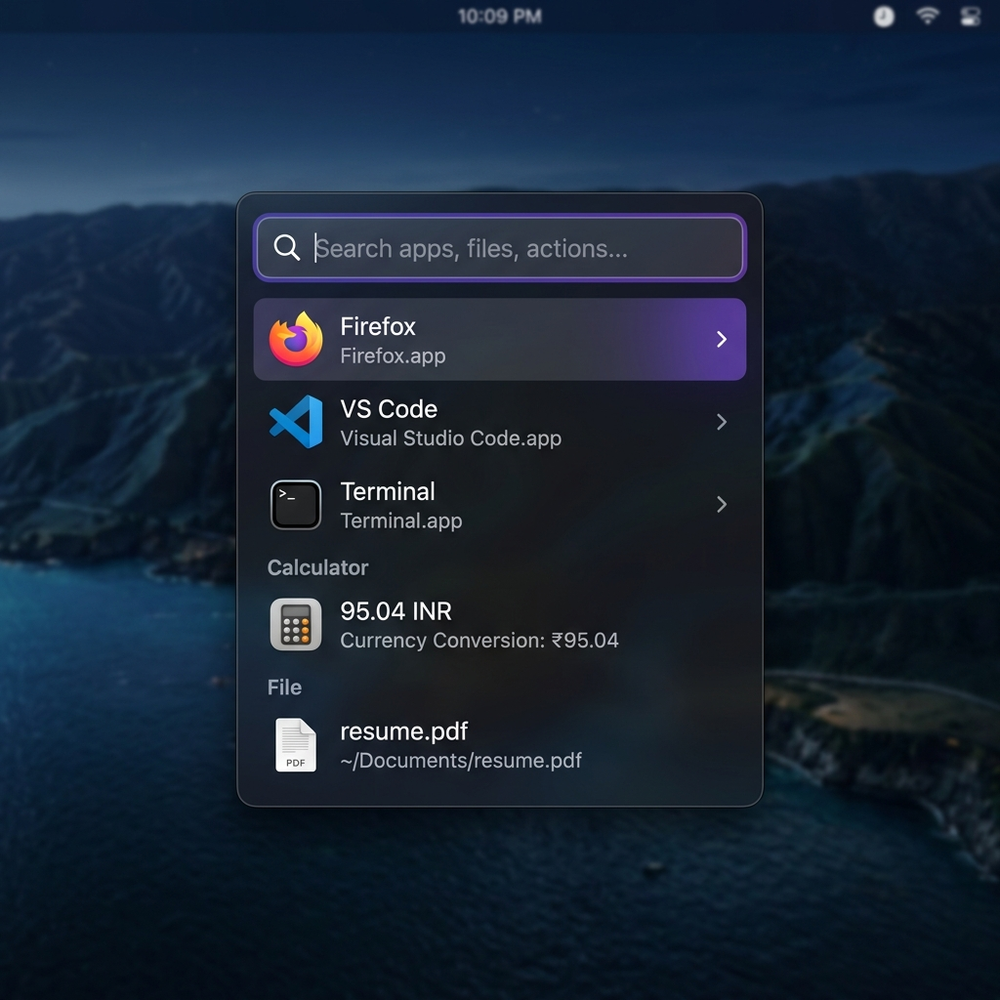

# 
🏔️ Crest

<b>The Raycast experience, finally on Linux.</b>

  

  
  
  

---

**Crest** is a high-performance, keyboard-first productivity launcher for the Linux desktop. Built with **Rust** and **Tauri**, it delivers a sub-50ms execution speed and a premium design language inspired by Raycast.

## ✨ Key Features

- 📋 **Clipboard History**: Native Rust listener with secure local persistence. Search back through days of copies instantly.
- 🌐 **Instant Web Search**: Privacy-respecting DuckDuckGo bridge with instant answers (Wikipedia, Calculator, etc.).
- 🚀 **App Launcher**: Blazing fast application indexing with fuzzy search and shortcut support.
- 🧩 **Plugin Engine**: Extensible architecture supporting JS, Python, and Bash scripts.
- 💎 **Premium UI**: Ultra-sharp glassmorphism, ⌘K action bars, and smooth Framer Motion transitions.
- 🔒 **Privacy First**: 100% local-first. No cloud syncing, no telemetry, no accounts.

## 🛠️ Technical Specs

- **Core**: Pure Rust for system integration (Clipboard, Indexing, Search).
- **UI**: React + TypeScript + Tailwind CSS via Tauri.
- **Database**: Local SQLite for high-speed metadata and history storage.
- **Footprint**: < 40MB RAM idle usage.

## 🚀 Installation & Setup

### 1. Download
Head to [GitHub Releases](https://github.com/KOUSTAV2409/crest/releases) and download the latest asset for your distribution:
- **Debian/Ubuntu**: `.deb` package
- **Generic Linux**: `.AppImage`

### 2. Install
- **Debian/Ubuntu**: `sudo apt install ./crest_0.1.0_amd64.deb`
- **Generic Linux**: `chmod +x crest.AppImage && ./crest.AppImage`

### 3. Bind Global Shortcut
To launch Crest from anywhere, bind the `crest` command to a keyboard shortcut in your Desktop Environment settings (e.g., `Alt + Space` or `Super + Space`).

## ⌨️ How to Use

- **Search**: Start typing to find apps, files, or calculate math.
- **Navigate**: Use `Up` and `Down` arrows to select results.
- **Execute**: Press `Enter` to launch the primary action.
- **Actions**: Press `Cmd + K` (or `Ctrl + K`) to open the secondary action menu.
- **Modes**: Use `Backspace` on an empty search bar to switch between Clipboard, Search, and File modes.

## 🛠️ Development Setup (For Contributors)

## 🗺️ Roadmap
- [ ] **Deep AI Integration**: Local LLM support for context-aware commands.
- [ ] **Plugin Marketplace**: A central registry for community extensions.
- [ ] **Mobile Remote**: Control your Linux desktop from your phone via local network.

## 📄 License
MIT © [Koustav](https://github.com/KOUSTAV2409)
